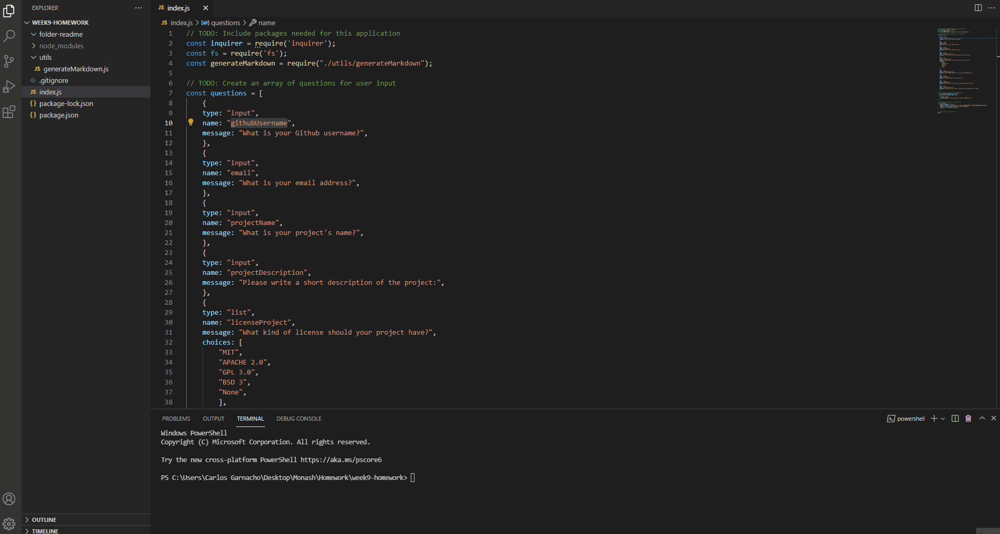

# Readme Generator
  
## Table Of Contents
  - [Description](#description)
  - [Installation](#installation)
  - [Usage](#usage)
  - [Questions](#questions)

## Description
This project allows the user to create a Readme just by answering a few questions.

You will need to enter your github user name, your email, project name, a description, installation instructions, usage information, contribution guidelines, test instructions and the license that you used.

All the answers will be displayed in the readme with a table of content and a section for questions at the end with your github user link and your email.

## Installation
To install necessary dependencies, run the following command: </br>
```bash
npm i inquirer
```

## Usage
You will be able to answer a few questions to create your Readme.</br>
In this gif you are able to see how to use the app

https://youtu.be/OJ_29h0Nn4g

## Questions
If you have any questions you can find me in: </br>
GitHub: https://github.com/GrilloGG </br>
Email: grillo.garnacho@gmail.com
